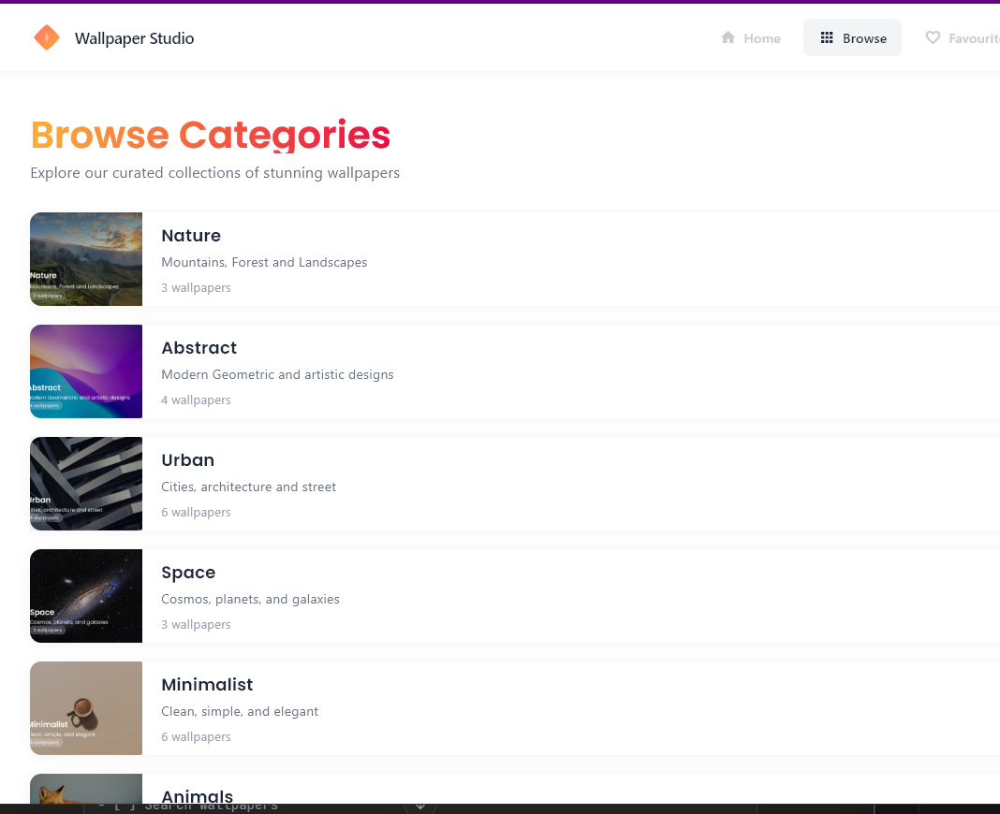

# Wallpaper Studio - Desktop Application

A beautiful and intuitive desktop wallpaper management application built with Flutter. Browse curated wallpaper collections, preview them on a realistic phone mockup, save your favorites, and set wallpapers with customizable display options.

)

## 🎯 Features

- **Browse Categories**: Explore wallpapers organized by categories (Nature, Abstract, Urban, Space, Minimalist, Animals)
- **Grid & List View**: Toggle between grid and list views for comfortable browsing
- **Real-time Preview**: View wallpapers on a realistic phone mockup before setting them
- **Favorites Management**: Save and manage your favorite wallpapers
- **Active Wallpaper**: Track and display your currently active wallpaper
- **Customizable Settings**: Configure display mode (Fit, Fill, Stretch, Tile), auto-rotation, and advanced options
- **Responsive Design**: Optimized for various desktop screen sizes
- **Modern UI**: Clean, gradient-based design with smooth animations

## 📋 Prerequisites

Before running this application, ensure you have the following installed:

- **Flutter SDK** (3.0.0 or higher) - [Installation Guide](https://docs.flutter.dev/get-started/install)
- **Visual Studio 2022** (for Windows) with "Desktop development with C++" workload
- **Git** - [Download](https://git-scm.com/downloads)
- **Windows 10/11** (64-bit)

## 🚀 Installation & Setup

### Step 1: Clone the Repository
```bash
git clone https://github.com/yourusername/wallpaper-studio.git
cd wallpaper-studio
```

### Step 2: Install Dependencies
```bash
flutter pub get
```

### Step 3: Verify Flutter Installation
```bash
flutter doctor
```

Ensure all checkmarks are green for Windows desktop development.

### Step 4: Enable Windows Desktop
```bash
flutter config --enable-windows-desktop
```

### Step 5: Add Image Assets

Place the following image files in `assets/images/`:
- `nature.png` - Nature category wallpaper
- `abstract.png` - Abstract category wallpaper
- `urban.png` - Urban category wallpaper
- `space.png` - Space category wallpaper
- `minimalist.png` - Minimalist category wallpaper
- `animals.png` - Animals category wallpaper

## ▶️ Running the Application

### Development Mode
```bash
flutter run -d windows
```

### Release Build

To create an optimized release build:
```bash
flutter build windows --release
```

 ## 🎥 Demo Video

- Watch the full walkthrough: https://drive.google.com/file/d/1qQDyPGLev-ku7US9g5bOGmECQJ1g3OlT/view?usp=sharing

The executable will be located at:
```
build\windows\x64\runner\Release\wallpaper_studio.exe
```

## 📁 Project Structure
wallpaper_studio/
├── lib/
│   ├── main.dart                          # App entry point
│   ├── constants/
│   │   ├── colors.dart                    # Color scheme
│   │   └── text_styles.dart               # Typography styles
│   ├── models/
│   │   ├── category.dart                  # Category data model
│   │   └── wallpaper.dart                 # Wallpaper data model
│   ├── screens/
│   │   ├── homepage.dart                  # Main homepage
│   │   ├── browse_screen.dart             # Browse categories page
│   │   ├── category_details_screen.dart   # Wallpaper details & preview
│   │   ├── favourites_screen.dart         # Saved wallpapers
│   │   ├── settings_screen.dart           # App settings
│   │   └── wallpaper_setup_screen.dart    # Wallpaper configuration
│   ├── widgets/
│   │   ├── top_navigation.dart            # Top navigation bar
│   │   ├── category_card.dart             # Category card widget
│   │   └── active_wallpaper_card.dart     # Active wallpaper display
│   └── services/
│       ├── favourites_service.dart        # Favorites management
│       └── active_wallpaper_service.dart  # Active wallpaper state
├── assets/
│   └── images/                            # Wallpaper images
├── windows/                               # Windows-specific files
└── pubspec.yaml                           # Project dependencies

## 🎨 App Screens

### 1. Homepage
- Hero section with gradient heading "Discover Beautiful Wallpapers"
- Category grid with 6 wallpaper categories
- "See All" button to browse all categories
- Shows active wallpaper card if a wallpaper is set

### 2. Browse Categories
- Toggle between Grid and List views
- All categories displayed with wallpaper counts
- Click any category to view wallpapers
- Responsive layout for different screen sizes

### 3. Wallpaper Details
- 3-column grid of wallpapers from selected category
- Real-time preview panel with phone mockup
- Click wallpapers to preview on device
- Favorite/unfavorite individual wallpapers
- Tags showing category and attributes
- "Save to favorites" and "Set as Wallpaper" buttons

### 4. Wallpaper Setup
- Configure display mode (Fit, Fill, Stretch, Tile)
- Enable/disable auto-rotation
- Advanced settings (Lock wallpaper, Sync across devices)
- Blurred preview of category on the left
- Save or cancel configuration

### 5. Favorites
- Grid view of all saved favorite wallpapers
- 6-column responsive grid
- Click heart icon to remove from favorites
- Empty state with "Browse Wallpapers" call-to-action
- Shows wallpaper name and category

### 6. Settings
- Configure image quality (High, Medium, Low)
- Enable/disable notifications
- Phone preview showing connection status
- Save settings or cancel changes

## 🛠️ Technologies Used

- **Flutter 3.x** - UI framework
- **Dart** - Programming language
- **Google Fonts** (Poppins) - Typography
- **Material Design 3** - Design system
- **Custom Painting** - Logo and custom graphics

## 📦 Dependencies
```yaml
dependencies:
  flutter:
    sdk: flutter
  cupertino_icons: ^1.0.2
  google_fonts: ^6.1.0
```

## 🎯 Key Features Implementation

### State Management
- Singleton pattern for FavouritesService and ActiveWallpaperService
- ChangeNotifier for reactive state updates
- No external state management libraries required

### Navigation
- Named routes for main screens
- MaterialPageRoute for dynamic screen transitions
- Active tab highlighting in navigation bar

### Responsive Design
- LayoutBuilder for adaptive layouts
- Grid and List view options
- Scrollable content areas
- Minimum screen width: 800px recommended

## 🐛 Troubleshooting

### Issue: "Flutter command not found"
**Solution**: Add Flutter to your system PATH. Follow [Flutter installation guide](https://docs.flutter.dev/get-started/install/windows).

### Issue: "Visual Studio not found"
**Solution**: Install Visual Studio 2022 with "Desktop development with C++" workload.

### Issue: Images not loading
**Solution**: Ensure all image assets are properly placed in `assets/images/` and listed in `pubspec.yaml`.

### Issue: Build fails on Windows
**Solution**: Run `flutter clean` then `flutter pub get` and try building again.

### Figma Link to design
- https://www.figma.com/design/WnHFPfZ7uW2vxy4sHqtb12/MOBILE-WALLPAPER-SELECTOR?node-id=0-1&p=f&t=2uDO3enoMFIThi2n-0

## 📸 Screenshots

### Homepage
)

### Browse Categories
, )

### Wallpaper Details
)

### Favorites
)

### Settings
)


## 📥 Download

**Windows Desktop Application**

[📦 Download Latest Release (v1.0.0)](https://github.com/Uchedivine/wallpaper-studio-desktop/releases/download/v1.0.0/wallpaper_studio_windows_v1.0.0.zip)

### Installation Instructions:
1. Download `wallpaper_studio_windows_v1.0.0.zip` from the link above
2. Extract all files to a folder on your computer
3. Open the extracted folder
4. Double-click `wallpaper_app.exe` to run the application
5. Enjoy browsing and setting wallpapers!

**Note**: Windows may show a security warning for unrecognized apps. Click "More info" → "Run anyway" to proceed.


## 🔧 Development

### Hot Reload
Press `r` in the terminal while running in debug mode to hot reload changes.

### Debug Mode
```bash
flutter run -d windows --debug
```

### Release Mode
```bash
flutter run -d windows --release
```

## 🤝 Contributing

This project was built as part of the HNG Internship Stage 3 task.

### Team
- **Mobile Track (Stage 3)** - Desktop Implementation
- **Task**: Build a pixel-perfect wallpaper selector application

## 📄 License

This project is part of the HNG Internship program.


---

**Built with ❤️ as part of HNG Internship Stage 3**

*Note: This is a demonstration project showcasing Flutter desktop development capabilities.*